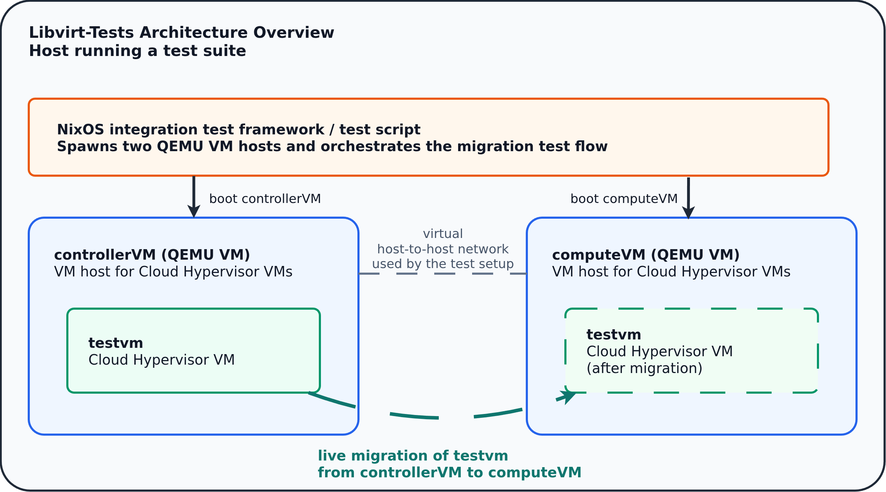

# Libvirt NixOS Tests

A minimal set of NixOS integration tests for validating specific Libvirt
features and supporting libvirt development.

These tests provide a convenient environment for:

- Running automated checks against Libvirt.
- Testing patches to virtualization backends (e.g., Cloud Hypervisor) by running
  the libvirt test suite in a reproducible NixOS VM environment.

## Flake Ownership

The root repository `flake.nix` is the single flake entry point for this merged
repository.

The Nix code in `nixos-tests/outputs.nix` is imported by the root flake and is
not intended to be evaluated as a standalone flake. Use the root flake for all
builds, checks, development shells, and test runs described in this document.

## Running Tests

_These tests utilize the NixOS integration test framework
(`<nixpkgs>/nixos/lib/testing`). Each test is a Bash script build by Nix and is
available in interactive mode (attribute `.driverInteractive`) as well as in
non-interactive mode (attribute `.driver`). For just running tests and seeing
test results, the non-interactive mode is fine. For interactive debugging,
please consider using the interactive mode. In interactive mode, you can type
`test_script()` into the Python REPL to run the test cases._

Build and run the default set of test cases:

```bash
nix run -L .#tests.x86_64-linux.default.driver
```

Every test attribute also exposes a passthru attribute offering the test
without enabling any port forwarding. This version is meant for the usage in
the CI, where port forwarding could fail because of occupied ports.

```bash
nix run .\#tests.x86_64-linux.default.passthru.no_port_forwarding.driver
```

It might happen that the integration test runs out of resources when the user's
tmp directory space is too small. You can try to mitigate this by setting
`XDG_RUNTIME_DIR=/tmp/libvirt` before invoking the test script.

### Test Infrastructure Overview



Overview of the host running the test script, the two QEMU VMs
`controllerVM` and `computeVM` acting as VM hosts for Cloud Hypervisor, and the
live migration of the Cloud Hyperivsor (CHV) VM between them. Not all test cases
need `computeVM`.


### Available Tests

The NixOS tests are divided into multiple test suites, each leveraging the
NixOS integration test framework. The NixOS tests are grouped by different
factors, e.g. the longer running live migration tests are separated. Following
test attributes are available. Each attribute can be run via
`nix run -L .#tests.x86_64-linux.<attribute>.driver`.

- `default`
  - default test suite containing most of the tests
- `live_migration`
  - live migration tests that usually take longer to run
- `hugepage`
  - tests that require hugepages in the host VM to be available
- `long_migration_with_load`
  - long-running migration series with a VM that is under heavy memory load
- `numa_hosts`
  - tests that check migrations between hosts with different NUMA configurations
- `cpu_profiles`
  - tests that run on hosts with different CPU profiles, including migration
    tests
  - need to run an a CPU compatible with CPU profile used in the respective test
- `windows`
  - tests run with Windows Server 2025 as guest OS
  - the OS image is quite large so you might want to have a look at
    `XDG_RUNTIME_DIR` (see above)
- `windows_cpu_profiles`
  - tests run with Windows Server 2025 as guest OS on with additional CPU
    profiles
  - the OS image is quite large so you might want to have a look at
    `XDG_RUNTIME_DIR` (see above)
  - need to run an a CPU compatible with the CPU profile used in the respective
    test

### Obtaining debug logs

To obtain debug logs from failing test cases automatically, set the
`DBG_LOG_DIR` environment variable:

```bash
DBG_LOG_DIR="./logs" nix run .#tests.x86_64-linux.default.driver
```

After the run is over, you can find relevant Libvirt and Cloud Hypervisor logs
in the `DBG_LOG_DIR`.

## Using a Custom Libvirt or Cloud Hypervisor

The tests already use the libvirt sources from this repository checkout. In
other words, running `nix run .#tests.x86_64-linux.<attribute>.driver` builds
libvirt from your local checkout rather than from an external libvirt input.

Because this repository is evaluated as a flake source, only Git-tracked files
are included. Local modifications to tracked files are picked up automatically,
but newly created untracked files are ignored until they are added to Git.

To test with a custom Cloud Hypervisor build or checkout, update the
`cloud-hypervisor` input in the root `flake.nix`, for example:

```nix
cloud-hypervisor.url = "git+file:/home/pschuster/dev/cloud-hypervisor";
```

If you are working on migration tests that also use the previous release, apply
the same change to `cloud-hypervisor-prev` or `libvirt-prev` as needed.

### SSH into the VMs

To access the QEMU VMs, you can run

- `ssh -o StrictHostKeyChecking=no root@localhost -p 2222` for the
  ***controllerVM***, and
- `ssh -o StrictHostKeyChecking=no root@localhost -p 3333` for the
  ***computeVM***.

Inside one of those VMs, you can use

`ssh -o StrictHostKeyChecking=no root@192.168.1.2`

with password `root` to access the Cloud Hypervisor VM (***testvm***).

To directly access the Cloud Hypervisor VM, you can run

`ssh -o StrictHostKeyChecking=no -J root@localhost:2222 root@192.168.1.2`.

## More Documentation
- [VM networks overview](./docs/networks.md)
- [Information on Windows Server 2025 image](./docs/windows_image.md)
